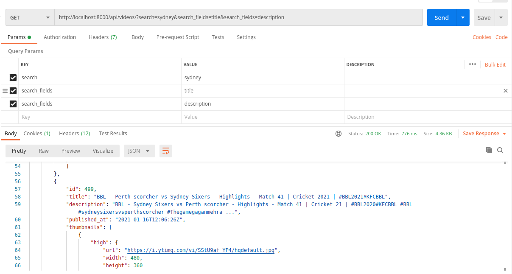

# Youtube Search

## Prerequisites

- Docker; if you don’t have it yet, follow the [installation instructions](https://docs.docker.com/install/#supported-platforms);
- Docker Compose; refer to the official documentation for the [installation guide](https://docs.docker.com/compose/install/).

## Setup

- Clone the repo
```bash
$ git clone https://github.com/rajat-np/yt-search
```

- To run locally, we need to setup environment variables:
  - Create ./envs/.local/.django to add following variables required by django service.
  ```
    # General
    # ------------------------------------------------------------------------------
    USE_DOCKER=yes
    IPYTHONDIR=/app/.ipython
    # Redis
    # ------------------------------------------------------------------------------
    REDIS_URL=redis://redis:6379/0

    # YOUTUBE
    YOUTUBE_API_KEY=<comma seperated api_key values for eg api_key1, api_key2>
    YOUTUBE_QUERY='<youtube api search query eg cricket'>
    FETCH_INTERVAL=<interval in seconds for async fetch of the API, eg 10>
  ```
  - Create ./envs/.local/.django to add following variables required by postgres service.
  ```
    # PostgreSQL
    # ------------------------------------------------------------------------------
    POSTGRES_HOST=postgres
    POSTGRES_PORT=5432
    POSTGRES_DB=yt_search
    POSTGRES_USER=debug
    POSTGRES_PASSWORD=debug

  ```

- Build and Run following stack in seperate terminal instance:
  - Django
  ```
  $ docker-compose -f local.yml build django
  $ docker-compose -f local.yml up django
  ```

  - celerybeat:
  ```
  $ docker-compose -f local.yml build celerybeat
  $ docker-compose -f local.yml up celerybeat
  ```

  - celeryworker:
  ```
  $ docker-compose -f local.yml build celeryworker
  $ docker-compose -f local.yml up celeryworker
  ```

- After a minute after running celerybeat and celeryworker the data will be saved in the db.

- To view the data in the django admin, create a superuser with following command and visit (http://localhost:8000/admin)

``` bash
 $ docker-compose -f local.yml run --rm django python manage.py createsuperuser
```
- To view API of list of videos visit (http://localhost:8000/api/videos)
  - This will return videos in descending order of published date.
  - API is using limit and offset to manage pagination and returns 10 objects per page.

- To search pass query params:
  - search: search text
  - search_fields: field on which we want to apply the search. See following image for example:
  


## Credits

- This project was bootstrapped with [cookiecutter-django](https://github.com/pydanny/cookiecutter-django).
